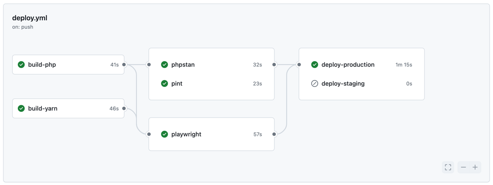

## GitHub Actions

De opdracht van vandaag: Zorg ervoor dat de volgende testen gedraaid worden bij elke push:

- PHPStan: `vendor/bin/phpstan analyse`
- Laravel Pint: `vendor/bin/pint`
- Playwright: `npx playwright test`

